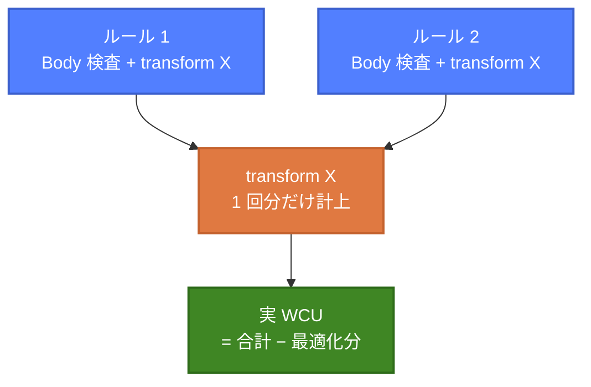
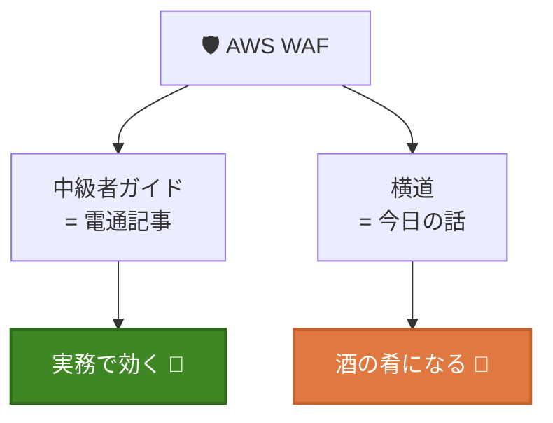

# あなたが知らなそうな<br/>AWS WAFの話

2026/X/X  
JAWS-UG ○○ #XX  
raiha(Ryo Aihara) / @raiha_tec

---
layout: two-cols
---

# aws sts get-caller-identity

- **仕事**
    - セキュリティ
    - SOCやログ分析基盤を作ってます
- **趣味**
    - (最近やってないけど)自作スピーカー / 自作キーボード
    - AIエージェントを使ったWebアプリの個人開発
- **最近**
    - WAFのチューニングで悲鳴を上げる毎日
- **好きなAWSサービス**
  <div class="flex gap-4 mt-2 ml-4">
    <div class="flex flex-col items-center">
      
      <span class="text-sm mt-1">ECS</span>
    </div>
    <div class="flex flex-col items-center">
      
      <span class="text-sm mt-1">CDK</span>
    </div>
  </div>

::right::

<div class="flex flex-col items-center justify-center h-full">
  
  <p class="mt-4">𝕏: @raiha_tec</p>
</div>

---

# 本日の立ち位置

<div class="mt-4">

<div class="grid grid-cols-7 gap-2 items-center text-center text-sm">

<div class="p-2 bg-slate-600 rounded">👶<br/>初心者</div>
<div class="text-2xl opacity-70">▶</div>
<div class="p-2 bg-orange-500/80 rounded font-bold">📰<br/>電通総研ブログ</div>
<div class="text-2xl opacity-70">▶</div>
<div class="p-2 bg-cyan-600 rounded font-bold">🧑‍💻<br/>中級者</div>
<div class="text-2xl opacity-70">▶</div>
<div class="p-2 bg-purple-600 rounded">🧙<br/>上級者</div>

<div></div>
<div></div>
<div></div>
<div></div>
<div class="text-xl opacity-70 leading-none">┊<br/>横道</div>
<div></div>
<div></div>

<div></div>
<div></div>
<div></div>
<div></div>
<div class="p-2 bg-green-600 rounded font-bold">🌳<br/>今日の話</div>
<div></div>
<div></div>

</div>

</div>

<div class="grid grid-cols-2 gap-4 mt-4 text-sm">

<div class="p-2 bg-orange-900/30 rounded">

### 📰 電通総研ブログ（前提）
「初心者を脱出する為に知っておきたかったこと8選」 = **中級者になるための本道**  
8 KB / マネージドルールのバージョン / etc.

</div>

<div class="p-2 bg-green-900/30 rounded">

### 🌳 今日の話（このLT）
**中級者レベルの内容だが、本道から横にちょっと逸れた茂み**  
知ってても明日の仕事は変わらない。飲み会のネタ用

</div>

</div>

---

# 今日のおしながき

<div class="grid grid-cols-2 gap-4 mt-4 text-sm">

<div>

1. **SizeRestrictions の隙間**  
  〜本体検査範囲とのズレ、そして書けないルール〜
2. **boto3 × WAF の LockToken**  
  〜なぜか update できない、を解く〜

</div>

<div>

3. **`check_capacity` は試算だけじゃない**  
  〜構文 validation も兼ねる隠し機能〜
4. **今ブロックされてる IP を覗く**  
  〜`get_rate_based_statement_managed_keys`〜

</div>

</div>

---

# AWS WAF 30秒おさらい

L7（HTTP）で動くマネージドWAF。CloudFront / ALB / API Gateway 等にアタッチ

<div class="flex justify-center mt-2">


</div>

- **Web ACL** ＞ **Rule Group**（マネージド or 自前）＞ **Rule** の階層
- ルールは上から順に評価、ラベル付与は終端でないアクション

---

# 🕳️ ① なぜ 8 KB の壁が危険なのか

例として **Body** だけ取り上げる。仕様・ルール・ギャップの3層で見る

<div class="text-xs mt-2 font-mono leading-tight">

```text
                    0KB     8KB    16KB        ...        50KB
                    │       │      │                         │
WAF 本体検査(ALB)   ████████ ← ここまでしか見ない (8 KB 固定)
CRS Block 閾値      ────────┃ > 8,192 B で Block ※Count に下げると無効
攻撃者の細工         ████████████████████████████████████████
                    └─ padding ─┘└── ' OR 1=1 -- ──────────┘
                       (ダミー)     (8 KB 以降の死角に隠す)
```

</div>

<div class="text-center text-sm mt-1 opacity-90">
→ SQLi / XSS の<strong>マネージドルールも 8 KB 以降は見ない</strong>。攻撃部分が完全に WAF の死角に入る
</div>

<div class="grid grid-cols-2 gap-3 mt-2 text-sm">

<div class="p-2 bg-purple-900/30 rounded">

### 📏 WAF 仕様上限（Body）
- **ALB / AppSync：8 KB 固定**（拡張不可）
- CloudFront / APIGW 等：16 KB → 最大 64 KB へ拡張可

</div>

<div class="p-2 bg-red-900/30 rounded">

### ⚠️ CRS とのギャップ
`SizeRestrictions_BODY` は **> 8,192 B で Block**  
→ これを **Count に下げる**と「巨大Body 許可・中身検査せず」  
= 攻撃者にとって理想的な状況

</div>

</div>

---

# 🕳️ ①続 サイズは書けるが、<br/>**個数は書けない**

<div class="text-center text-sm mt-1 font-mono">

`Cookie:` <span class="bg-blue-500/30 px-1">🍪1</span> <span class="bg-blue-500/30 px-1">🍪2</span> <span class="bg-blue-500/30 px-1">🍪3</span> ... <span class="bg-blue-500/30 px-1">🍪200</span> ┃ <span class="bg-red-500/40 px-1 font-bold">💣 201</span> <span class="bg-red-500/40 px-1 font-bold">💣 202</span> ...

<div class="flex justify-center gap-8 text-xs mt-1">
  <div>👁️ <strong>WAF が見る範囲</strong>（先頭 200 個）</div>
  <div>🙈 <strong>見えない領域</strong>（201 個目以降）</div>
</div>

</div>

<div class="grid grid-cols-2 gap-4 mt-2 text-sm">

<div>

### ✅ サイズはカスタムで書ける

```yaml
SizeConstraintStatement:
  FieldToMatch:
    SingleHeader: { Name: cookie }
  ComparisonOperator: GT
  Size: 5000          # ← バイト数のみ
```

</div>

<div>

### ❌ 個数で書く手段がない

| やりたいこと | 可否 |
|---|---|
| Cookie が **201 個以上** | ❌ |
| Header が **201 個以上** | ❌ |
| Query パラメータが **N 個以上** | ❌ |

statement に **「カウント」プリミティブが無い**

</div>

</div>

<div class="mt-2 p-2 bg-red-900/30 rounded text-sm">

🚨 小さな Cookie を 200 個以上詰めれば、201 個目以降に**ペイロードを隠せる**（マネージドにもカスタムにも弾く術なし）

</div>

---

# 🛠️ ② boto3 で WAF 更新時の **LockToken の罠**

WAF は **楽観ロック**でリソース管理。`LockToken` を握っていないと更新が拒否される

<div class="grid grid-cols-2 gap-4 mt-1 text-xs">

<div>

### ❌ ハマるコード

```python
import boto3
c = boto3.client('wafv2')

c.update_web_acl(
    Name='my-acl', Scope='REGIONAL',
    Id='abc123',
    DefaultAction={'Allow': {}},
    Rules=[...], VisibilityConfig={...},
)
# 💥 WAFOptimisticLockException
```

</div>

<div>

### ✅ 正解：`get` で取って `update` に渡す

```python
# 1. get で LockToken を取得
r = c.get_web_acl(Name='my-acl',
    Scope='REGIONAL', Id='abc123')
lt = r['LockToken']  # ← これ

# 2. update に LockToken 同梱
c.update_web_acl(
    Name='my-acl', Scope='REGIONAL', Id='abc123',
    DefaultAction={'Allow': {}},
    Rules=r['WebACL']['Rules'],
    VisibilityConfig=r['WebACL']['VisibilityConfig'],
    LockToken=lt,  # ← 必須
)
```

</div>

</div>

<div class="mt-2 p-2 bg-purple-900/30 rounded text-xs">

🔑 Web ACL / Rule Group / IP Set / Regex Pattern Set すべて **LockToken 必須**。`WAFOptimisticLockException` を食らったら再 `get` してリトライ

</div>

---

# 📐 予習：WCU の世界

WAF が **ルール / Rule Group / Web ACL** の処理リソースを管理する仕組み

<div class="grid grid-cols-2 gap-4 mt-2 text-xs">

<div>

### 🧱 3階層の WCU 上限

```text
Web ACL   ─┬─ 基本料金で  1,500 WCU
           ├─ 最大        5,000 WCU
           └─ 超過分は 追加課金

Rule Group ┬─ 最大        5,000 WCU
           └─ 作成時に Capacity 確定 🔒
              (immutable / 変更不可)

Rule  ─────┬─ タイプ毎に WCU が違う
           ├─ SizeConstraint  → 低
           └─ Regex / JsonBody → 高
```

</div>

<div>

### 💡 知らないとハマるポイント

- **immutable なのは Capacity の "数値" だけ**  
  → 中の **ルール追加 / 削除 / 更新は自由**  
  → ただし合計 WCU は宣言値内に収める必要あり  
  → 超過するときだけ **Rule Group ごと作り直し**

- Web ACL に載せた Rule Group のコストは  
  **実 WCU ではなく宣言した Capacity 値**で固定  
  （余裕を持たせると Web ACL 側で損もある）

- transformation / JSON body inspection を  
  足すとルール WCU が **跳ね上がる**

</div>

</div>

<div class="mt-2 p-2 bg-purple-900/30 rounded text-xs">

🔑 WCU は「実際の検査内容には影響しない、AWS 側のリソース予約」。だから事前計画が大事
</div>

---

# 📐 WCU の二面性

<div class="text-sm opacity-90">Rule Group の中では最適化される。でも Web ACL に載せると...</div>

<div class="grid grid-cols-2 gap-4 mt-2 text-xs">

<div>

### 🧮 中の WCU は合計より小さくなり得る



**同じコンポーネントに同じ transformation** を適用するルールが複数 → AWS WAF は処理を共有化  
→ 変換コストは **1 回分しか計上されない**

</div>

<div>

### 💰 Web ACL では **宣言 Capacity 値で固定**

```text
作成時に宣言した Capacity:  100 WCU
中身の実 WCU（最適化後）:    20 WCU
                            ↓
Web ACL が消費する WCU: ████████ 100
                       （宣言値が固定で乗る）
```

→ 「実 WCU が最適化で減った嬉しさ」は  
**Web ACL レベルでは現れない**  
→ 過大宣言は Web ACL の WCU 枠を食い潰す

</div>

</div>

<div class="mt-2 p-2 bg-purple-900/30 rounded text-xs">

🎯 Capacity の見積もりは「足りなくならない範囲で、できるだけ小さく」。<code>check_capacity</code> で実態を測ってから宣言値を決めるのが安全

</div>

---

# 🛠️ ③ `check_capacity` は<br/>**試算だけじゃない**

WCU 試算 API …と思いきや、引数のルールを **構文 validation** までしてくれる

<div class="grid grid-cols-2 gap-4 mt-2 text-xs">

<div>

### 💡 構文 **validation** も同時に走る

引数の `Rules` をパースするので、不正なルールがあると **`WAFInvalidParameterException`** を返してくる

検出される構文エラー（例）：
- ネスト不可な statement のネスト
- `OR Statement` にネスト1個だけ
- 不正な `FieldToMatch` / パラメータ値

→ **Dry-run** として CI に仕込めば WCU 超過 + 構文ミスを同時検査（IPSet ARN 実在性などは別 API）

</div>

<div>

### ✅ `check_capacity` の使い方

```python
import boto3
c = boto3.client('wafv2')
resp = c.check_capacity(
    Scope='REGIONAL',  # or CLOUDFRONT
    Rules=[{'Name': 'block-bad-bots',
            'Priority': 1,
            'Action': {'Block': {}},
            'Statement': {...},
            'VisibilityConfig': {...}}])
print(resp['Capacity'])  # → 5 WCU
```

</div>

</div>

<div class="mt-1 px-2 py-0.5 bg-purple-900/30 rounded text-xs leading-tight">🔑 マネージドルールは <code>describe_managed_rule_group</code> で個別 WCU を取得 → <code>check_capacity</code> に渡して合算試算もできる</div>

---

# 🛠️ ④ 今ブロック中の IP を覗く

`get_rate_based_statement_managed_keys` で **現在 rate-limit にハマっている IP** を取得（最大 10,000 件）

<div class="grid grid-cols-2 gap-4 mt-2 text-xs">

<div>

### 📋 何が取れるか

- **IPv4 / IPv6 リスト**（現在 rate limit にハマってる IP）
- 最大 **10,000 件**。超過分はレート最大のものが残る
- Web ACL × Rule Group × Rate-based rule 単位で独立管理

### ⚠️ 制約

- `AggregateKeyType` が **`IP` or `FORWARDED_IP`** の rule のみ
- `CONSTANT` / `CUSTOM_KEYS` だと  
  `WAFUnsupportedAggregateKeyTypeException` 💥
- → Cookie ベース等の rate-limit は不可視

</div>

<div>

### 🔧 使い方

```python
import boto3
c = boto3.client('wafv2')

resp = c.get_rate_based_statement_managed_keys(
    Scope='REGIONAL',
    WebACLName='my-acl',
    WebACLId='abc123',
    RuleName='block-too-many-reqs',
)

print(resp['ManagedKeysIPV4']['Addresses'])
# → ['203.0.113.5', '198.51.100.42', ...]
print(resp['ManagedKeysIPV6']['Addresses'])
```

</div>

</div>

<div class="mt-1 px-2 py-1 bg-purple-900/30 rounded text-xs">

🔑 障害時の「今、誰が引っかかってる？」をログ無しで即時取得可。CloudWatch メトリクスでは IP 単位まで見えない

</div>

---
layout: two-cols
---

# まとめ

<div class="text-sm space-y-2">

1. **SizeRestrictions の隙間** — 本体検査範囲とのズレ＋「個数」を弾くカスタムも書けない
2. **LockToken の罠** — boto3 で WAF を更新するなら `get` で取って `update` に渡す
3. **`check_capacity` は試算だけじゃない** — WCU 計算と構文 validation を同時に
4. **今ブロックされてる IP を覗く** — `get_rate_based_statement_managed_keys`

</div>

<div class="mt-3">

役に立つ日が来るかは知りません 🤷

</div>

::right::

<div class="flex flex-col items-center justify-center h-full">



</div>

---
layout: center
---

# ご清聴ありがとうございました 🙏

<div class="flex flex-col items-center gap-4 mt-8">

<div class="flex items-center gap-6">
  
  <div class="text-left">
    <p class="text-xl">raiha (Ryo Aihara)</p>
    <p class="opacity-80">𝕏: <strong>@raiha_tec</strong></p>
  </div>
</div>

<p class="mt-6 text-lg">
質問・感想は X までお気軽に！
</p>

</div>
