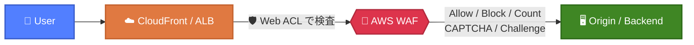

# あなたが知らなそうな<br/>AWS WAFの話

2026/5/30  
JAWS-UG 彩の国埼玉支部 #8 彩の国埼玉支部 1周年   
raiha(Ryo Aihara) / @raiha_tec

---
layout: two-cols
---

# aws sts get-caller-identity

- **仕事**
    - SOC運用やログ分析基盤を作ってます
- **趣味**
    - (最近やってないけど)自作スピーカー / 自作キーボード
    - AI/ローカルLLMで遊ぶ（自作Aqua Voice/Google MeetでVTuberするChrome拡張）
- **LT**
    - 彩の国埼玉支部 2回目(#0、今回)
    - Slidevでの発表 2回目
    - Security-JAWS CfP落ちの内容を話します
- **好きなAWSサービス**
  <div class="flex gap-4 mt-2 ml-4">
    <div class="flex flex-col items-center">
      
      <span class="text-sm mt-1">ECS</span>
    </div>
    <div class="flex flex-col items-center">
      
      <span class="text-sm mt-1">CDK</span>
    </div>
  </div>

::right::

<div class="flex flex-col items-center justify-center h-full">
  
  <p class="mt-4">𝕏: @raiha_tec</p>
</div>

---

# 本日の立ち位置

<div class="mt-4">

<div class="grid grid-cols-7 gap-2 items-center text-center text-sm">

<div class="p-2 bg-slate-600 rounded">👶<br/>初心者</div>
<div class="text-2xl opacity-70">▶</div>
<div class="p-2 bg-orange-500/80 rounded font-bold">📰<br/>電通総研ブログ</div>
<div class="text-2xl opacity-70">▶</div>
<div class="p-2 bg-cyan-600 rounded font-bold">🧑‍💻<br/>中級者</div>
<div class="text-2xl opacity-70">▶</div>
<div class="p-2 bg-purple-600 rounded">🧙<br/>上級者</div>

<div></div>
<div></div>
<div></div>
<div></div>
<div class="text-xl opacity-70 leading-none">┊<br/>横道</div>
<div></div>
<div></div>

<div></div>
<div></div>
<div></div>
<div></div>
<div class="p-2 bg-green-600 rounded font-bold">🌳<br/>今日の話</div>
<div></div>
<div></div>

</div>

</div>

<div class="grid grid-cols-2 gap-4 mt-4 text-sm">

<div class="p-2 bg-orange-900/30 rounded">

### 📰 電通総研ブログ（前提）
「AWS WAF について最初から知りたかったこと8選」   
= **初心者:Lv200**と**中級者:Lv300**の間ぐらい？  
8 KB / マネージドルールのバージョン / etc.

</div>

<div class="p-2 bg-green-900/30 rounded">

### 🌳 今日の話（このLT）
どちらかといえば**中級者**だが、なくても困らない…か？  
明日からすぐ使える！系の話はないです

</div>

</div>

<div class="mt-3 text-xs opacity-70">
📖 <a href="https://tech.dentsusoken.com/entry/8_things_i_wanted_to_know_about_aws_waf">電通総研ブログ：AWS WAF について最初から知りたかったこと8選</a>
</div>

---

# AWS WAF おさらい

L7（HTTP）で動くマネージドWAF。CloudFront / ALB / API Gateway 等にアタッチ

<div class="flex justify-center mt-2">



</div>

- **Web ACL** ＞ **Rule Group**（マネージド or 自前）＞ **Rule** の階層
- ルールは上から順に評価、ラベル付与は終端でないアクション

---

# ①もはや知られていないことで有名な8KB
<span class="text-xs opacity-60">※「AWS WAF について最初から知りたかったこと8選」にも記載あり</span>  
**Body** の例  

<div class="text-xs mt-2 font-mono leading-tight">

```text
                    0KB     8KB    16KB        ...        50KB
                    │       │      │                         │
WAF 本体検査(ALB)   ████████ ← ここまでしか見ない (8 KB まで)
CRS Block 閾値      ────────┃ > 8,192 B で Block ※Count に下げると無効
攻撃者の細工         ████████████████████████████████████████
                    └─ padding ─┘└── ' OR 1=1 -- ──────────┘
                       (ダミー)     (8 KB 以降の死角に隠す)
```

</div>

<div class="text-center text-sm mt-1 opacity-90">
→ SQLi / XSS の<strong>マネージドルールも 8 KB 以降は見ない</strong>。攻撃部分が完全に WAF の死角に入る
</div>

<div class="grid grid-cols-2 gap-3 mt-2 text-sm">

<div class="p-2 bg-purple-900/30 rounded">

### 📏 WAF 仕様上限（Body）
- **ALB / AppSync：8 KB 固定**（拡張不可）
- CloudFront / APIGW 等：16 KB → 最大 64 KB へ拡張可  

Body部のうち、先頭8~64KBまでをAWS WAFは検査する

</div>

<div class="p-2 bg-red-900/30 rounded">

### ⚠️ CommonRuleSetの誤った理解
`SizeRestrictions_BODY` は **> 8,192 B で Block**  
→ 単に大きいリクエストを拒否するルールと考えると…  
→ **Count にする**と「8KB以降のBody部が検査されない」  
= 攻撃されやすい・気づきづらい

</div>

</div>

<div class="mt-2 text-xs opacity-70">
📖 <a href="https://docs.aws.amazon.com/ja_jp/waf/latest/developerguide/waf-oversize-request-components.html">AWS Docs: Oversize request components in AWS WAF</a>
</div>

---

# ①続 サイズは書けるが、**個数は書けない**

<div class="text-center text-sm mt-1 font-mono">

`Cookie:` <span class="bg-blue-500/30 px-1">🍪1</span> <span class="bg-blue-500/30 px-1">🍪2</span> <span class="bg-blue-500/30 px-1">🍪3</span> ... <span class="bg-blue-500/30 px-1">🍪200</span> ┃ <span class="bg-red-500/40 px-1 font-bold">💣 201</span> <span class="bg-red-500/40 px-1 font-bold">💣 202</span> ...

<div class="flex justify-center gap-8 text-xs mt-1">
  <div>👁️ <strong>WAF が見る範囲</strong>（先頭 200 個）</div>
  <div>🙈 <strong>見えない領域</strong>（201 個目以降）</div>
</div>

</div>

<div class="grid grid-cols-2 gap-4 mt-2 text-sm">

<div>

### ✅ サイズはカスタムで書ける

```yaml
SizeConstraintStatement:
  FieldToMatch:
    Body: { OversizeHandling: MATCH }
  ComparisonOperator: GT
  Size: 16384         # ← 16 KB 超を Block
```

💡 `SizeConstraintStatement` は **Content-Length ベース**なので<br/>**検査範囲(8KB)を超えるサイズ**でも書ける  
→ CRS の `SizeRestrictions_BODY`(8KB) より大きい閾値も自由に設定可

</div>

<div>

### ❌ 個数で書く手段がない

| やりたいこと | 可否 |
|---|---|
| Cookie が **201 個以上** で Block | ❌ |
| Header が **201 個以上** で Block | ❌ |

WAF 側に「先頭 200 個まで」の **検査上限** があるのに、<br/>statement に **「個数を数える」プリミティブが無い**

→ 検査上限を超えた死角を、個数で塞げない

</div>

</div>

<div class="mt-2 p-2 bg-red-900/30 rounded text-sm">

🚨 小さな Cookie を 200 個以上詰めれば、201 個目以降に**ペイロードを隠せる**

</div>

---

# 🧪 **FieldToMatch** × **OversizeHandling**

<div class="text-xs opacity-70 mt-1">CloudFront + WAF で「Header 値に <code>BLOCKME</code> を含めば Block」のルールを構成。ダミー Header の数と marker 位置を変えて curl で検証</div>

<div class="text-sm mt-2">

| 検査方式 | OversizeHandling | marker が範囲内<br>(≤200 個目) | marker が範囲外<br>(≥201 個目) | marker 無し<br>＋ 201 個超 |
|---|:---:|:---:|:---:|:---:|
| `SingleHeader`（名前指定） | (n/a) | 🛑 Block | 🛑 Block | ✅ Allow |
| `Headers` + `IncludedHeaders` | any | 🛑 Block | 🛑 Block | ✅ Allow |
| `Headers` + `All` | `CONTINUE` <span class="text-xs opacity-60">(既定)</span> | 🛑 Block | <span class="bg-red-500/40 px-1">✅ **Bypass**</span> | ✅ Allow |
| `Headers` + `All` | `NO_MATCH` | 🛑 Block | <span class="bg-red-500/40 px-1">✅ **Bypass**</span> | ✅ Allow |
| `Headers` + `All` | `MATCH` | 🛑 Block | 🛑 Block | <span class="bg-amber-500/40 px-1">🛑 **誤検知 Block**</span> |

</div>

<div class="mt-3 text-sm leading-relaxed">

🔑 **名前指定（SingleHeader / IncludedHeaders）は 200 個制限の対象外** — 名前で直接取り出すため位置と無関係<br/>
🔑 **全件スキャン（Headers / All）のみ 200 個制限が効く** — 既定の `CONTINUE` は **バイパス余地アリ**、`MATCH` はバイパス潰せるが正規 200 個超ユーザを誤検知

</div>

---

# 🛠️ ② boto3 で WAF 更新時の **LockToken**

WAF は **楽観ロック**でリソース管理。`LockToken` を握っていないと更新が拒否される

<div class="grid grid-cols-2 gap-4 mt-1 text-xs">

<div>

### ❌ LockTokenなし

```python
import boto3
c = boto3.client('wafv2')

c.update_web_acl(
    Name='my-acl', Scope='REGIONAL',
    Id='abc123',
    DefaultAction={'Allow': {}},
    Rules=[...], VisibilityConfig={...},
)
# 💥 WAFOptimisticLockException
```

</div>

<div>

### ✅ `get` で取得 `update` に渡す

```python
# 1. get で LockToken を取得
r = c.get_web_acl(Name='my-acl',
    Scope='REGIONAL', Id='abc123')
lt = r['LockToken']  # ← これ

# 2. update に LockToken 同梱
c.update_web_acl(
    Name='my-acl', Scope='REGIONAL', Id='abc123',
    DefaultAction={'Allow': {}},
    Rules=r['WebACL']['Rules'],
    VisibilityConfig=r['WebACL']['VisibilityConfig'],
    LockToken=lt,  # ← 必須
)
```

</div>

</div>

<div class="mt-2 p-2 bg-purple-900/30 rounded text-xs">

🔑 Web ACL / Rule Group / IP Set / Regex Pattern Set すべて **LockToken 必須**。`WAFOptimisticLockException` を食らったら再 `get` してリトライ

</div>

---

# 📐 WCU: WebACL Capacity Unit

雑に言うと **ルールの大きさ** 。ルールが複雑だと必要なWCUは大きくなる。

<div class="grid grid-cols-2 gap-4 mt-2 text-xs">

<div>

### 🧱 3階層の WCU 上限

```text
Web ACL   ─┬─ 基本料金で  1,500 WCU
           ├─ 最大        5,000 WCU
           └─ 超過分は 追加課金

Rule Group ┬─ 最大        5,000 WCU
           └─ 作成時に Capacity 確定 🔒
              (immutable / 変更不可)

Rule  ─────┬─ タイプ毎に WCU が違う
           ├─ SizeConstraint  → 低
           └─ Regex / JsonBody → 高
```

</div>

<div>

### 💡 知らないとハマるポイント

- Rule GropのWCUは**immutable**   
  → 中の **ルール追加 / 削除 / 更新は自由**  
  → ただし合計 WCU は宣言値内に収める必要あり  
  → 超過する場合は **Rule Group ごと作り直し**

- Web ACL に載せた Rule Group のコストは  
  **実 WCU ではなく宣言した Capacity 値**で固定  
  → 固定されているので、Rule Group内を自由に更新しても、Web ACLにルールを載せられる。

- transformation / JSON body inspection を足すとルール WCU が **増加**

</div>

</div>

<div class="mt-2 p-2 bg-purple-900/30 rounded text-xs">

🔑 WCU は「実際の検査内容には影響しない、AWS 側のリソース予約」。だから事前計画が大事
</div>

---

# 🛠️ ③ `check_capacity` で **WCUの計算**

デプロイする前にWCUの試算ができる  
引数のルールを **構文 validation** という効果も

<div class="grid grid-cols-2 gap-4 mt-2 text-xs">

<div>

### ✅ `check_capacity` の使い方

```python
import boto3
c = boto3.client('wafv2')
resp = c.check_capacity(
    Scope='REGIONAL',  # or CLOUDFRONT
    Rules=[{'Name': 'block-bad-bots',
            'Priority': 1,
            'Action': {'Block': {}},
            'Statement': {...},
            'VisibilityConfig': {...}}])
print(resp['Capacity'])  # → 5 WCU
```

</div>

<div>

### 💡 構文 **validation** も同時に走る

引数の `Rules` をパースするので、不正なルールがあると **`WAFInvalidParameterException`** を返してくる

検出される構文エラー（例）：
- ネスト不可な statement のネスト
- `OR Statement` にネスト1個だけ
- 不正な `FieldToMatch` / パラメータ値

→ **Dry-run** として CI に仕込めば WCU 超過 + 構文ミスを同時検査（IPSet ARN 実在性などは別 API）

</div>


</div>

<div class="mt-2 p-2 bg-purple-900/30 rounded text-xs">🔑 マネージドルールは <code>describe_managed_rule_group</code> で個別 WCU を取得 → <code>check_capacity</code> に渡して合算試算もできる
</div>

---

# 🎲 例題：このルール、何 WCU？

<div class="grid grid-cols-2 gap-3 mt-1 text-xs">

<div>

### rule1 — JP × `.*/test/.*`

```json
{
  "Statement": { "AndStatement": { "Statements": [
    { "GeoMatchStatement": {
        "CountryCodes": ["JP"] } },
    { "RegexMatchStatement": {
        "RegexString": ".*/test/.*",
        "FieldToMatch": { "Body": {...} },
        "TextTransformations": [
          { "Priority": 0, "Type": "URL_DECODE" },
          { "Priority": 1, "Type": "LOWERCASE" }
        ] } }
  ] } }
}
```

</div>

<div>

### rule2 — US × `.*/example/.*`

```json
{
  "Statement": { "AndStatement": { "Statements": [
    { "GeoMatchStatement": {
        "CountryCodes": ["US"] } },
    { "RegexMatchStatement": {
        "RegexString": ".*/example/.*",
        "FieldToMatch": { "Body": {...} },
        "TextTransformations": [
          { "Priority": 0, "Type": "URL_DECODE" },
          { "Priority": 1, "Type": "LOWERCASE" }
        ] } }
  ] } }
}
```

</div>

</div>

<div class="mt-1 text-center text-lm">
🤔 <strong>両方を同じ Web ACLに載せた</strong>とき、消費 WCU は何？<br/>
単純合計と <code>check_capacity</code> の結果は一致する？
</div>

---

# 🎲 例題：まずは 1 ルールの WCU

<div class="grid grid-cols-2 gap-4 mt-2 text-xs">

<div>

### 📖 公式表（ルールタイプごとの WCU）

| 要素 | WCU |
|---|---|
| `GeoMatchStatement` | **1** |
| `RegexMatchStatement` (Body) | **3** |
| `URL_DECODE` transformation | **+10** |
| `LOWERCASE` transformation | **+10** |
| `AndStatement` | 子の合計 |

</div>

<div>

### 🧮 rule1 / rule2 の内訳

```text
GeoMatchStatement            1 WCU
RegexMatchStatement (Body)   3 WCU
  └ URL_DECODE              10 WCU
  └ LOWERCASE               10 WCU
AndStatement (集約)           -
─────────────────────────────────
合計                         24 WCU
```

→ **rule1 = 24 WCU / rule2 = 24 WCU**  
→ 2 ルール束ねたら、単純合計 = **48 WCU** ？

</div>

</div>

<div class="mt-2 p-2 bg-cyan-900/30 rounded text-xl text-center">

🤔 結局WCUはいくつ... ？

</div>

---

# 🎲 例題：答え合わせ

<div class="grid grid-cols-2 gap-4 mt-2 text-xs">

<div>

### ✨ `check_capacity` で実測すると…

```python
c.check_capacity(
    Scope='REGIONAL',
    Rules=[rule1, rule2]
)
# → {'Capacity': 28}
```

```text
単純合計  48 WCU  ████████████████
実測値    28 WCU  █████████
差分     -20 WCU  ← 最適化分
```

</div>

<div>

### 💡 なぜ 20 WCU 減るのか

**両ルールが同じ条件を満たしている**：
- 同じ component（**Body**）を検査
- 同じ transformation（**URL_DECODE + LOWERCASE**）を適用

→ AWS WAF は **変換処理を 1 回にまとめる**  
→ 2 ルール分の transformation コスト  
  `(10 + 10) × 2 = 40` のうち **半分の 20 WCU が削減**

</div>

</div>

<div class="mt-2 p-2 bg-purple-900/30 rounded text-xs">

🔑 同じ component に同じ transformation を当てるルールが増えても WCU はリニアに増えない。<strong>Web ACL 内 / Rule Group 内</strong>のどちらでも最適化される

</div>

---

# 🎲 最適化が効く / 効かないパターン

<div class="text-xs opacity-90">同じ rule1 / rule2 でも <strong>配置の仕方</strong> で最適化の効き方が変わる</div>

<div class="grid grid-cols-3 gap-2 mt-2 text-xs">

<div class="p-2 bg-green-900/30 rounded">

### ✅ パターン A
**Web ACL に直接 2 ルール**

```text
┌─ Web ACL ─────────┐
│  rule1            │
│  rule2            │
└───────────────────┘
```

→ **28 WCU** ✨  
（最適化が効く）

</div>

<div class="p-2 bg-green-900/30 rounded">

### ✅ パターン B
**1 つの Rule Group**

```text
┌─ Web ACL ─────────┐
│ ┌─ RuleGroup ───┐ │
│ │  rule1        │ │
│ │  rule2        │ │
│ └───────────────┘ │
└───────────────────┘
```

| 観点 | WCU |
|---|---|
| RG 内（実消費） | **28** ✨ |
| Web ACL 視点 | RG の **宣言 Capacity 値** |

→ RG 内では最適化が効く（実 WCU が下がる）

</div>

<div class="p-2 bg-red-900/30 rounded">

### ❌ パターン C
**別々の Rule Group**

```text
┌─ Web ACL ─────────┐
│ ┌─ RG-A ────┐     │
│ │  rule1    │     │
│ └───────────┘     │
│ ┌─ RG-B ────┐     │
│ │  rule2    │     │
│ └───────────┘     │
└───────────────────┘
```

| 観点 | WCU |
|---|---|
| RG-A / RG-B 内 | **24** / **24** |
| Web ACL 視点 | 各 RG の **宣言 Capacity 値の合計** |

→ RG をまたぐと最適化が効かない

</div>

</div>

<div class="mt-2 p-2 bg-purple-900/30 rounded text-xs">

🔑 Web ACL 視点の Rule Group コストは <strong>作成時の宣言 Capacity 値で固定</strong>（実消費 WCU ではない）。最適化されてもされなくても Web ACL の WCU 枠を食うのは宣言値の合計

</div>

---

# 🛠️ ④ 今ブロック中の IP を覗く

`get_rate_based_statement_managed_keys` で **現在 rate-limit にハマっている IP** を取得（最大 10,000 件）

<div class="grid grid-cols-2 gap-4 mt-2 text-xs">

<div>

### 📋 何が取れるか

- **IPv4 / IPv6 リスト**（現在 rate limit にハマってる IP）
- 最大 **10,000 件**。超過分はレート最大のものが残る
- Web ACL × Rule Group × Rate-based rule 単位で独立管理

### ⚠️ 制約

- `AggregateKeyType` が **`IP` or `FORWARDED_IP`** の rule のみ
- `CONSTANT` / `CUSTOM_KEYS` だと  
  `WAFUnsupportedAggregateKeyTypeException` 💥
- → Cookie ベース等の rate-limit は不可視

</div>

<div>

### 🔧 使い方

```python
import boto3
c = boto3.client('wafv2')

resp = c.get_rate_based_statement_managed_keys(
    Scope='REGIONAL',
    WebACLName='my-acl',
    WebACLId='abc123',
    RuleName='block-too-many-reqs',
)

print(resp['ManagedKeysIPV4']['Addresses'])
# → ['203.0.113.5', '198.51.100.42', ...]
print(resp['ManagedKeysIPV6']['Addresses'])
```

</div>

</div>

<div class="mt-1 px-2 py-1 bg-purple-900/30 rounded text-xs">

🔑 障害時の「今、誰が引っかかってる？」をログ無しで即時取得可。CloudWatch メトリクスでは IP 単位まで見えない

</div>

---

# まとめ

<div class="text-lm space-y-2">

1. **8 KB の死角** — サイズは弾けるが、**個数は弾けない**
2. **LockToken** — boto3 で更新するなら `get` → `update`
3. **`check_capacity`** — WCUの試算API
4. **WCU** の話 - テキスト変換のWCU
5. **`get_rate_based_statement_managed_keys`** — 今ブロック中の IP

</div>

<div class="mt-3 text-sm">

知らないよりは知っていたほうがいいはず…

</div>

<div class="mt-3 p-2 bg-slate-700/40 rounded text-xs">

📝 話さなかったこと：**WAF ログフォーマットの話** — 細かい話で長くなるのでカット

</div>


---
layout: center
---

# 📢 告知 ① — JAWS SONIC 2026

<div class="flex flex-col items-center gap-4 mt-4">


<div class="text-center">

### JAWS SONIC 2026 / MIDNIGHT JAWS 2026 - THE MARATHON -
**2026/9/5 (土) 12:00 〜 9/6 (日) 12:00** ／ オンライン開催 🌐  
24 時間ぶっ通しの JAWS-UG オンラインイベント

<div class="mt-2 text-sm">
🔗 <a href="https://jaws-ug.connpass.com/event/393837/">jaws-ug.connpass.com/event/393837/</a>
</div>

</div>

</div>

---
layout: center
---

# 📢 告知 ② — JAWS FESTA AKITA 2026

<div class="flex flex-col items-center gap-4 mt-4">


<div class="text-center">

### JAWS FESTA AKITA 2026
**2026/11/7 (土)** ／ あきた芸術劇場ミルハス 🎭  
秋田さ来てたんせ！ 🌾

<div class="mt-2 text-sm">
🔗 <a href="https://jawsfesta2026.jaws-ug.jp/">jawsfesta2026.jaws-ug.jp</a>
</div>

</div>

</div>

---
layout: center
---

# ご清聴ありがとうございました 🙏

<div class="flex flex-col items-center gap-4 mt-8">

<div class="flex items-center gap-6">
  
  <div class="text-left">
    <p class="text-xl">raiha</p>
    <p class="opacity-80">𝕏: <strong>@raiha_tec</strong></p>
  </div>
</div>

<p class="mt-6 text-lg">
質問・感想はお気軽にどうぞ！
</p>

</div>
