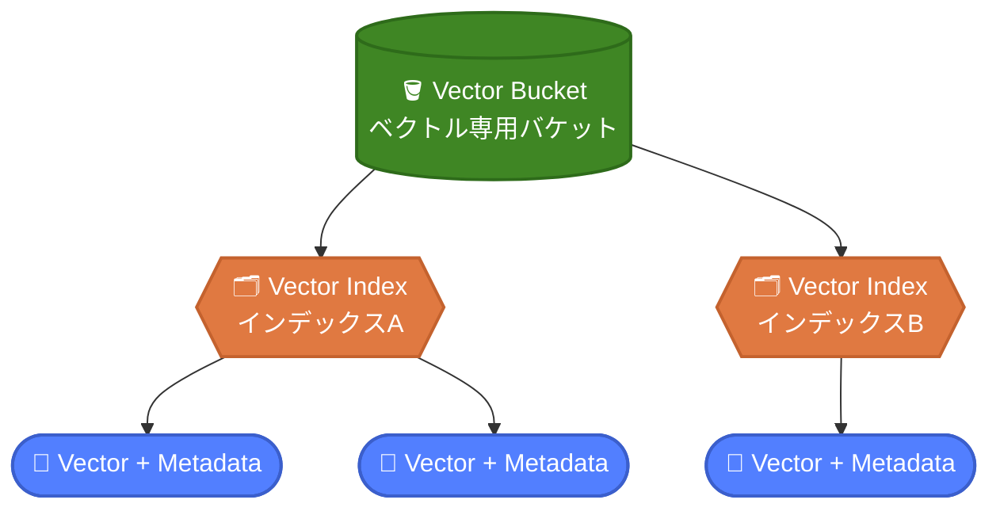
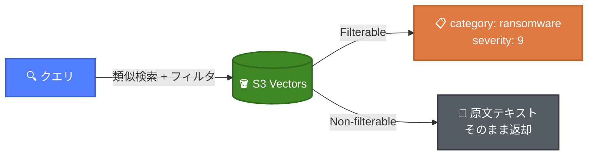
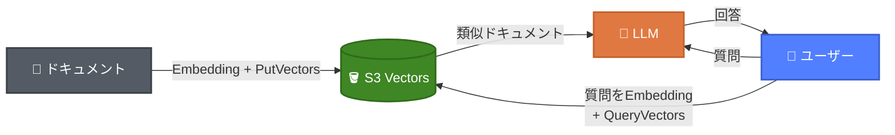
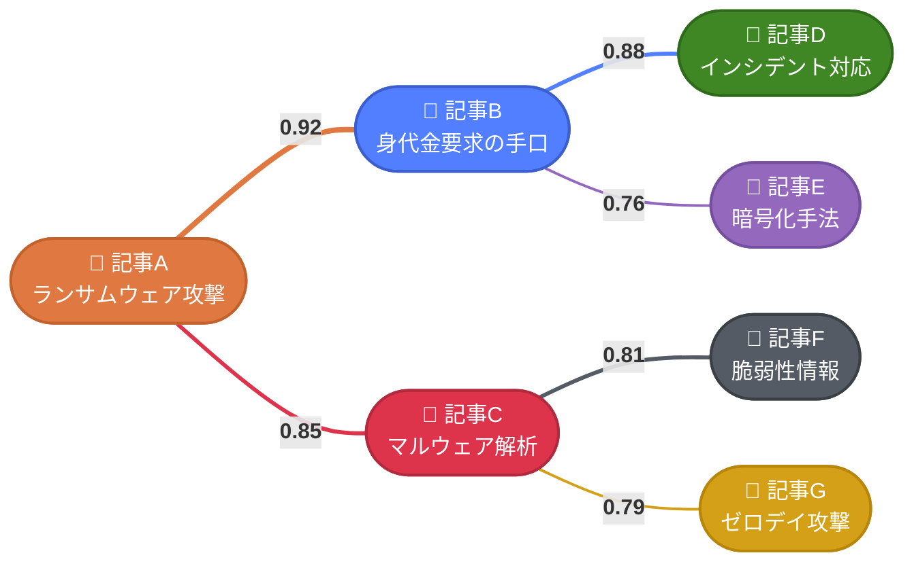
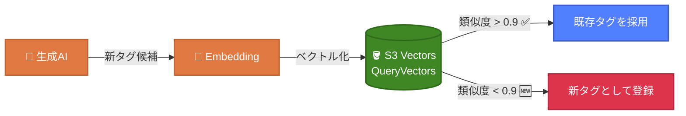

# S3 Vectorsの"じゃない"使い方

2026/3/11  
JAWS-UG 茨城 #12 春の推しAWSサービスLTまつり！  
raiha(Ryo Aihara) / @raiha_tec

---
layout: two-cols
---

# aws sts get-caller-identity

- **仕事**
    - セキュリティ
    - SOCやログ分析基盤を作ってます
- **趣味**
    - (最近やってないけど)自作スピーカー / 自作キーボード
    - AIエージェントを使ったWebアプリの個人開発
- **好きなAWSサービス**
  <div class="flex gap-4 mt-2 ml-4">
    <div class="flex flex-col items-center">
      
      <span class="text-sm mt-1">ECS</span>
    </div>
    <div class="flex flex-col items-center">
      
      <span class="text-sm mt-1">CDK</span>
    </div>
  </div>

::right::

<div class="flex flex-col items-center justify-center h-full">
  
  <p class="mt-4">𝕏: @raiha_tec</p>
</div>

---
layout: two-cols
---

# S3 Vectorsとは

**AWSのフルマネージドなベクトルストア**

- 2025年7月プレビュー → 2025年12月GA
- ベクトルデータの保存・クエリに特化した専用API
- サーバーレス：インフラのプロビジョニング不要
- S3と同等の耐久性（11 9）・可用性(SLA99.9%)
- 1秒未満のクエリレスポンス
- 最大**20億ベクトル/インデックス**、最大**4,096次元**

::right::

<div class="flex items-center justify-center h-full">
  
</div>

---
layout: two-cols
---

# S3 Vectorsの構成



::right::

<div class="pl-4 pt-12">

### 3つの主要コンポーネント

- **Vector Bucket** - ベクトル専用の新しいバケットタイプ
- **Vector Index** - ベクトルデータを整理・類似度検索する単位
- **Vector** - 埋め込みベクトル＋メタデータ（タグ、カテゴリ等）

</div>

<div class="absolute bottom-8 left-12 right-12 text-sm opacity-80 flex items-center gap-4">
<Youtube id="soa2HY6_X3o"/>
<div>

 [AI Agent Ready なベクトルストアの最新事情 - S3 Vectors と OpenSearch の使いどころ](https://youtu.be/soa2HY6_X3o?si=HPkKRSqZyFTXEwto)  
 👈オススメです（ギリギリGA前の動画です）

</div>
</div>

---

# S3 Vectorsのメタデータ

ベクトルに付与できる2種類のメタデータ

| | Filterable | Non-filterable |
|---|---|---|
| クエリ時のフィルタリング | ⭕ 可能 | ❌ 不可 |
| サイズ上限 | **2 KB** | **40 KB**(Filterableとの合計) |
| 用途 | カテゴリ、日付等 | 原文テキスト等 |

<div class="flex justify-center">    

</div>

---

# メタデータフィルタリング

クエリ時にベクトル検索とフィルタ評価を**同時に実行**

<div class="flex gap-6">
<div class="flex-1">

```python
result = s3vectors.query_vectors(
    vectorBucketName="security-news",
    indexName="articles",
    queryVector={"float32": embedding},
    topK=5,
    filter={
        "$and": [
            {"category": {"$eq": "ransomware"}},
            {"severity": {"$gte": 7}},
            {"date": {"$gte": "2026"}}
        ]
    }
)
```

</div>
<div class="flex-1 text-sm">

| 引数 | 説明 |
|------|------|
| `vectorBucketName` | 検索対象のVector Bucket |
| `indexName` | 検索対象のVector Index |
| `queryVector` | 検索クエリのベクトル |
| `topK` | 返却する類似ベクトル数 |
| `filter` | Filterableメタデータの絞り込み条件 |


</div>
</div>

- フィルタは**後処理ではなく検索と並行**して評価
- 演算子: `$eq`, `$ne`, `$gt`, `$gte`, `$lt`, `$lte`, `$in`, `$nin`, `$exists`, `$and`, `$or`

---

# よくある使い方：RAG

S3 Vectors を使った自前RAGの構成例



- **前処理**: ドキュメントをチャンク分割 → Embeddingモデルでベクトル化 → `PutVectors`で保存
- **ランタイム**: 質問をベクトル化 → `QueryVectors`で類似ドキュメント検索 → LLMにコンテキストとして渡し回答生成
- **S3 VectorsのAPIだけ**で安価なRAGが組める

<div class="absolute bottom-12 left-12 right-12 text-xl">

これが王道の使い方。今日は **RAGじゃない使い方** を紹介します！

</div>

---

# "じゃない"使い方① グラフっぽい可視化

S3 Vectorsの**類似度スコア**を関係値として活用する

<div class="flex justify-center">



</div>

記事をベクトル化 → QueryVectorsで上位N件＋スコア取得 → **類似度をエッジの重みとしてグラフ構築**

---

# demo

<Youtube id="JiHf-P8qn1M?start=158" class="w-full h-96" />

---

# "じゃない"使い方② タグの自動生成

生成AIのタグ付けの「ブレ」を S3 Vectors で抑制する

**課題**: 生成AIでタグを作ると表記がブレる

| 記事 | 生成AIのタグ |
|------|------------|
| 記事A | `ランサムウェア`, `サイバー攻撃` |
| 記事B | `ランサムウエア`, `サイバーアタック` |
| 記事C | `身代金型ウイルス`, `cyber attack` |

→ 同じ概念なのにタグが統一されない！  
（タグを事前に決めておく方法もあるかもしれないが、**放置していても**問題なく扱えるようにしたい…）

---

# タグ統一の仕組み



<div class="flex gap-8">
<div class="flex-1">

1. 生成AIが自由にタグを生成
2. タグをベクトル化してS3 Vectorsにクエリ
3. 類似度が高い → 既存タグを採用
4. 類似タグがない → 新タグとして登録

※既存のタグと新規のタグのどっちを使えばいいのかという考慮は必要かも…

</div>
<div class="flex-1">

```json
{
    "level": "INFO",
    "message": "Tag normalization completed",
    "timestamp": "2026-03-10T07:31:14.438159Z",
    "logger": "AIAnalysisHandler",
    "context": {
        "article_id": "web_20260310073059_6e8bd3d6",
        "new_tags": [
            "Data Sovereignty"
        ],
        "matched_tags": {
            "Cybersecurity": "Cybersecurity",
            "Funding": "Funding"
        }
    }
}
```

</div>
</div>

---

# コスト：S3 Vectorsは安い

1000万ベクトル（1024次元）の場合の月額コスト例（[S3料金ページ 料金の例1](https://aws.amazon.com/jp/s3/pricing/) より）

| 項目 | 単価 | コスト/月 |
|------|------|----------|
| ストレージ（59GB） | $0.06/GB | $3.54 |
| PUT（月16.7%更新） | $0.20/GB | $1.97 |
| クエリ（100万回） | $2.5/百万回 + データ処理 | $5.87 |
| **合計** | | **$11.38** |

**メリット**: サーバーレスで **月額約$11** は安い！

**デメリット**: コールドクエリはサブ秒（数百ms〜1秒）

---

# アプリでのコスト（2週間分）
※現在アプリで取り込んでいる量が**少ない**。かつ、データを**保持し続ける**必要性はあるので、もっとコストはかかるはず。
<div class="flex justify-center">
  
</div>

---
layout: two-cols
---

# 宣伝

今回紹介した内容使ったアプリを **10000 AIdeas Competition** に応募しています！

#### [Threat Lens - AI-Powered Threat Intelligence for IT Teams](https://builder.aws.com/content/39Zwk1hzeRS3kB9phS3GjJOQb1F/aideas-threat-lens-ai-powered-threat-intelligence-for-it-teams)


セミファイナル突破の条件が記事の「いいね」の数です！  
是非お願いします！🙏😭

<div class="flex justify-center mt-4">
  
</div>

::right::

<div class="flex items-center justify-center h-full">
  
</div>

---
layout: two-cols
---

# まとめ

- **S3 Vectors** = ベクトルネイティブなサーバーレスストレージ
- 安くベクトルストアを使いたいなら有力な選択肢
- レイテンシが許容できるユースケースに最適
- RAGだけでなく **類似度スコア** を活用した応用が可能
  - **グラフっぽい可視化**: 記事間の関連性をスコアで表現
  - **タグの自動生成**: 生成AIのブレをベクトル類似度で抑制
- ## 「いいね」頼む🙏😭

::right::

<div class="flex items-center justify-center h-full">
  
</div>
