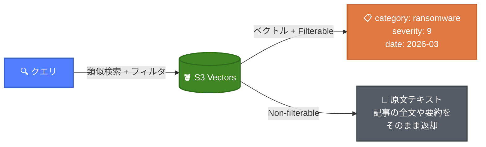
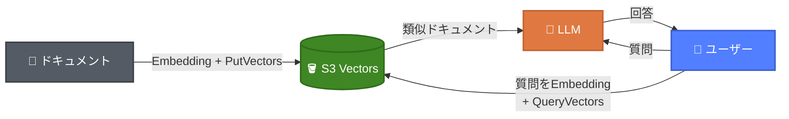
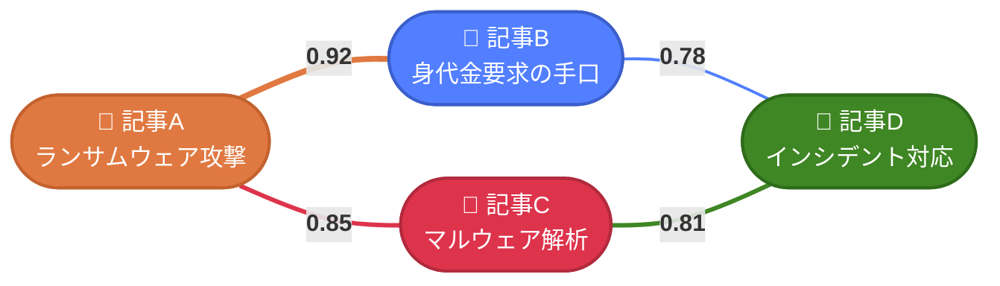
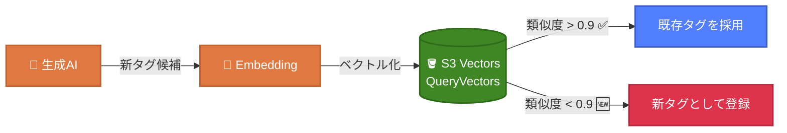

# S3 Vectorsの"じゃない"使い方

RAGだけじゃもったいない！S3 Vectorsの新しい活用法

---

# 目次

1. S3 Vectorsとは
2. ベクトルストア比較
3. S3 Vectorsの仕組み
4. メタデータとフィルタリング
5. よくある使い方：RAG
6. "じゃない"使い方① グラフネットワーク可視化
7. "じゃない"使い方② タグの自動生成
8. コスト
9. まとめ

---

# S3 Vectorsとは

AWS初の**ベクトルネイティブなオブジェクトストレージ**

- 2025年7月プレビュー → 2025年12月GA
- ベクトルデータの保存・クエリに特化した専用API
- サーバーレス：インフラのプロビジョニング不要
- S3と同等の耐久性（イレブンナイン）・可用性
- サブ秒のクエリレスポンス（頻繁なクエリは100ms以下）
- 最大**20億ベクトル/インデックス**、最大**4,096次元**

---

# AWSのベクトルストア比較

| | S3 Vectors | OpenSearch Serverless | Aurora pgvector |
|---|---|---|---|
| **アーキテクチャ** | サーバーレス | サーバーレス | マネージドDB |
| **最低コスト** | **従量課金のみ** | ~$700/月（2 OCU） | インスタンス費用 |
| **レイテンシ** | サブ秒〜100ms | ミリ秒 | ミリ秒 |
| **ハイブリッド検索** | ❌ ベクトルのみ | ⭕ 全文検索+ベクトル | ⭕ SQL+ベクトル |
| **メタデータフィルタ** | ⭕ | ⭕ | ⭕（SQLで実現） |
| **最大ベクトル数** | 20億/インデックス | 制限なし（スケール依存） | ストレージ依存 |
| **運用負荷** | なし | 低い | 中程度 |

**S3 Vectorsが向いているケース**: 低コスト・大規模・バッチ処理・シンプルなベクトル検索

**OpenSearch/Auroraが向いているケース**: 低レイテンシ・全文検索併用・複雑なクエリ

---

# S3 Vectorsの仕組み

3つの主要コンポーネント


- **Vector Bucket** - ベクトル専用の新しいバケットタイプ
- **Vector Index** - ベクトルデータを整理・類似度検索する単位
- **Vector** - 埋め込みベクトル＋メタデータ（タグ、カテゴリ等）

---

# S3 Vectorsのメタデータ

ベクトルに付与できる2種類のメタデータ

| | Filterable（デフォルト） | Non-filterable |
|---|---|---|
| クエリ時のフィルタリング | ⭕ 可能 | ❌ 不可 |
| サイズ上限/ベクトル | **2 KB** | 合計 **40 KB**（filterable含む） |
| 用途 | カテゴリ、日付、ステータス等 | 原文テキスト、詳細説明等 |
| 設定タイミング | 自動（デフォルト） | インデックス作成時に指定 |
| 対応型 | string, number, boolean, list | 任意 |

---

# メタデータフィルタリング

クエリ時にベクトル検索とフィルタ評価を**同時に実行**

```python
# 類似度検索 + メタデータフィルタを同時に適用
result = s3vectors.query_vectors(
    vectorBucketName="security-news",
    indexName="articles",
    queryVector={"float32": target_embedding},
    topK=5,
    filter={
        "$and": [
            {"category": {"$eq": "ransomware"}},
            {"severity": {"$gte": 7}},
            {"date": {"$gte": "2026-01"}}
        ]
    }
)
```

- フィルタは**後処理ではなく検索と並行**して評価 → 精度の高い結果
- 演算子: `$eq`, `$ne`, `$gt`, `$gte`, `$lt`, `$lte`, `$in`, `$nin`, `$exists`, `$and`, `$or`

---

# メタデータの活用パターン

Non-filterable メタデータで**原文をそのまま保持**できる



- **Filterable**: 絞り込み条件（カテゴリ、日付、重要度など）
- **Non-filterable**: クエリ結果と一緒に返したいコンテキスト情報
  - 別データソースを参照せずに原文を取得できる

---

# よくある使い方：RAG

S3 Vectors を使った自前RAGの構成例



- **前処理**: ドキュメントをチャンク分割 → Embeddingモデルでベクトル化 → `PutVectors`で保存
- **ランタイム**: 質問をベクトル化 → `QueryVectors`で類似ドキュメント検索 → LLMにコンテキストとして渡し回答生成
- Knowledge Bases不要、**S3 VectorsのAPIだけ**でRAGが組める

これが王道の使い方。でも今日は...

## S3 Vectorsの**"じゃない"**使い方を紹介します

---

# "じゃない"使い方① グラフネットワーク可視化

S3 Vectorsの**類似度スコア**を関係値として活用する



記事をベクトル化 → QueryVectorsで上位3件＋スコア取得 → **類似度をエッジの重みとしてグラフ構築**

---

# グラフネットワーク可視化の流れ

```python
# 1. 記事をベクトル化して保存
s3vectors.put_vectors(
    vectorBucketName="security-news",
    indexName="articles",
    vectors=[{
        "key": "article-001",
        "data": {"float32": embedding},  # 1024次元
        "metadata": {"title": "ランサムウェア攻撃の最新動向", "date": "2026-03"}
    }]
)

# 2. 類似記事をクエリ（上位3件）
result = s3vectors.query_vectors(
    vectorBucketName="security-news",
    indexName="articles",
    queryVector={"float32": target_embedding},
    topK=3
)
# → [{"key": "article-042", "score": 0.92}, ...]

# 3. スコアをエッジの重みとしてグラフを構築
```

ベクトルDBなしで **記事間の関連性を可視化** できる！

---

# "じゃない"使い方② タグの自動生成

生成AIのタグ付けの「ブレ」を S3 Vectors で抑制する

**課題**: 生成AIでタグを作ると表記がブレる

| 記事 | 生成AIのタグ |
|------|------------|
| 記事A | `ランサムウェア`, `サイバー攻撃` |
| 記事B | `ランサムウエア`, `サイバーアタック` |
| 記事C | `身代金型ウイルス`, `cyber attack` |

→ 同じ概念なのにタグが統一されない！

---

# タグ統一の仕組み



1. 生成AIが自由にタグを生成（創造性を活かす）
2. タグをベクトル化してS3 Vectorsにクエリ
3. 既存タグと類似度が高い → 既存タグを採用
4. 類似タグがない → 新しいタグとして登録

**生成AIの柔軟性** × **ベクトル類似度による統一** = ブレないタグ付け

---

# コスト：S3 Vectorsは安い

1000万ベクトル（1024次元）の場合の月額コスト例

| 項目 | 単価 | コスト/月 |
|------|------|----------|
| ストレージ（59GB） | $0.06/GB | $3.54 |
| PUT（月16.7%更新） | $0.20/GB | $1.97 |
| クエリ（100万回） | $2.5/百万回 + データ処理 | $5.87 |
| **合計** | | **$11.38** |

**メリット**: サーバーレスで **月額約$11** は圧倒的に安い

**デメリット**: コールドクエリはサブ秒（数百ms〜1秒）

→ リアルタイム検索には不向き。バッチ処理やオフライン分析向き

<!--
参考: https://aws.amazon.com/s3/pricing/
OpenSearch Serverlessは最低でも月額数百ドル〜かかるため、S3 Vectorsは圧倒的にコスト効率が良い
-->

---

# まとめ

- **S3 Vectors** = ベクトルネイティブなサーバーレスストレージ
- RAGだけでなく **類似度スコア** を活用した応用が可能
  - **グラフネットワーク可視化**: 記事間の関連性をスコアで表現
  - **タグの自動生成**: 生成AIのブレをベクトル類似度で抑制
- **月額$11〜** で始められるコスト効率の良さ
- レイテンシが許容できるユースケースに最適

## ご清聴ありがとうございました
